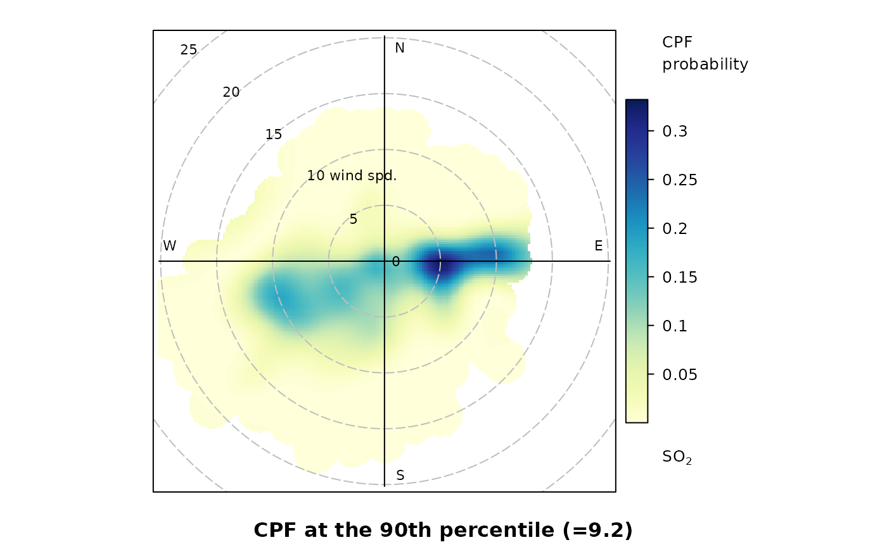

# Examples of {openair} Functionality

This vignette outlines some core functionality in
[openair](https://openair-project.github.io/openair/). For further
examples, please see the [online
book](https://openair-project.github.io/book/).

``` r
library(openair)
```

## Import data from the UK Automatic Urban and Rural Network

It is easy to import hourly data from 100s of sites and to import
several sites at one time and several years of data.

``` r
kc1 <- importAURN(site = "kc1", year = 2020)
kc1
#> # A tibble: 8,784 × 15
#>    source site     code  date                   co   nox   no2    no    o3   so2
#>    <chr>  <chr>    <chr> <dttm>              <dbl> <dbl> <dbl> <dbl> <dbl> <dbl>
#>  1 aurn   London … KC1   2020-01-01 00:00:00 0.214  64.8  46.2 12.1   1.13    NA
#>  2 aurn   London … KC1   2020-01-01 01:00:00 0.237  74.1  45.0 19.0   1.20    NA
#>  3 aurn   London … KC1   2020-01-01 02:00:00 0.204  60.5  41.4 12.4   1.50    NA
#>  4 aurn   London … KC1   2020-01-01 03:00:00 0.204  53.5  39.8  8.93  1.60    NA
#>  5 aurn   London … KC1   2020-01-01 04:00:00 0.169  37.7  33.6  2.63  5.79    NA
#>  6 aurn   London … KC1   2020-01-01 05:00:00 0.160  43.3  36.8  4.25  6.09    NA
#>  7 aurn   London … KC1   2020-01-01 06:00:00 0.157  48.2  39.4  5.76  2.74    NA
#>  8 aurn   London … KC1   2020-01-01 07:00:00 0.178  60.5  44.7 10.3   1.20    NA
#>  9 aurn   London … KC1   2020-01-01 08:00:00 0.233  71.8  47.9 15.6   2.25    NA
#> 10 aurn   London … KC1   2020-01-01 09:00:00 0.329 128.   46.9 53.2   2.25    NA
#> # ℹ 8,774 more rows
#> # ℹ 5 more variables: pm10 <dbl>, pm2.5 <dbl>, ws <dbl>, wd <dbl>,
#> #   air_temp <dbl>
```

## Utility functions

Using the
[`selectByDate()`](https://openair-project.github.io/openair/reference/selectByDate.md)
function it is easy to select quite complex time-based periods. For
example, to select weekday (Monday to Friday) data from June to
September for 2012 and for the hours 7am to 7pm inclusive:

``` r
sub <- selectByDate(
  kc1,
  day = "weekday",
  year = 2020,
  month = 6:9,
  hour = 7:19
)
sub
#> # A tibble: 1,144 × 15
#>    date                source site    code      co   nox   no2    no    o3   so2
#>    <dttm>              <chr>  <chr>   <chr>  <dbl> <dbl> <dbl> <dbl> <dbl> <dbl>
#>  1 2020-06-01 07:00:00 aurn   London… KC1   0.125   23.1 16.8  4.14   56.5  2.29
#>  2 2020-06-01 08:00:00 aurn   London… KC1   0.133   25.2 17.8  4.79   61.7  2.68
#>  3 2020-06-01 09:00:00 aurn   London… KC1   0.119   15.6 12.2  2.22   75.8  2.35
#>  4 2020-06-01 10:00:00 aurn   London… KC1   0.104   13.8 11.1  1.79   87.1  1.57
#>  5 2020-06-01 11:00:00 aurn   London… KC1   0.0956  14.0 11.8  1.46   96.7  1.44
#>  6 2020-06-01 12:00:00 aurn   London… KC1   0.0985  11.3  9.97 0.893 106.   1.44
#>  7 2020-06-01 13:00:00 aurn   London… KC1   0.0927  11.0  9.64 0.893 112.   2.03
#>  8 2020-06-01 14:00:00 aurn   London… KC1   0.0927  12.5 10.8  1.14  114.   2.81
#>  9 2020-06-01 15:00:00 aurn   London… KC1   0.0811  10.7  9.48 0.822 115.   2.88
#> 10 2020-06-01 16:00:00 aurn   London… KC1   0.0898  13.9 11.9  1.29  104.   2.22
#> # ℹ 1,134 more rows
#> # ℹ 5 more variables: pm10 <dbl>, pm2.5 <dbl>, ws <dbl>, wd <dbl>,
#> #   air_temp <dbl>
```

Similarly it is easy to time-average data in many flexible ways. For
example, 2-week means can be calculated as

``` r
sub2 <- timeAverage(kc1, avg.time = "2 week")
sub2
#> # A tibble: 27 × 12
#>    date                   co   nox   no2    no    o3   so2  pm10 pm2.5    ws
#>    <dttm>              <dbl> <dbl> <dbl> <dbl> <dbl> <dbl> <dbl> <dbl> <dbl>
#>  1 2019-12-30 00:00:00 0.135  26.2  22.7  2.34  46.4  1.94 12.5   8.43  3.94
#>  2 2020-01-13 00:00:00 0.205  74.4  37.3 24.2   30.4  2.68 18.5  13.1   3.11
#>  3 2020-01-27 00:00:00 0.143  39.4  26.7  8.24  47.8  2.72 13.9   8.45  4.51
#>  4 2020-02-10 00:00:00 0.118  19.2  16.4  1.85  63.0  3.09  9.40  5.03  6.18
#>  5 2020-02-24 00:00:00 0.144  31.4  24.5  4.50  53.5  2.61 10.4   5.99  4.54
#>  6 2020-03-09 00:00:00 0.116  19.7  17.0  1.73  60.0  2.09 10.0   5.73  4.61
#>  7 2020-03-23 00:00:00 0.132  23.2  19.8  2.26  69.1  1.90 18.9  12.3   3.61
#>  8 2020-04-06 00:00:00 0.112  27.1  24.1  1.99  72.4  2.02 26.1  18.2   2.96
#>  9 2020-04-20 00:00:00 0.103  15.8  14.1  1.13  76.7  2.09 16.8   9.60  3.45
#> 10 2020-05-04 00:00:00 0.112  17.8  15.7  1.35  76.0  1.85 13.7   8.32  3.29
#> # ℹ 17 more rows
#> # ℹ 2 more variables: wd <dbl>, air_temp <dbl>
```

## The `type` option

One of the key aspects of openair is the use of the `type` option, which
is available for almost all
[openair](https://openair-project.github.io/openair/) functions. The
`type` option partitions data by different categories of variable. There
are many built-in options that `type` can take based on splitting your
data by different date values. A summary of in-built values of type are:

- `"year"` splits data by year

- `"month"` splits variables by month of the year

- `"monthyear"` splits data by year and month

- `"season"` splits variables by season. Note in this case the user can
  also supply a `hemisphere` option that can be either `"northern"`
  (default) or `"southern"`

- `"weekday"` splits variables by day of the week

- `"weekend"` splits variables by Saturday, Sunday, weekday

- `"daylight"` splits variables by nighttime/daytime. Note the user must
  supply a longitude and latitude

- `"dst"` splits variables by daylight saving time and non-daylight
  saving time

- `"wd"` if wind direction (`wd`) is available. `type = "wd"` will split
  the data up into 8 sectors: N, NE, E, SE, S, SW, W, NW.

- `"seasonyear"` (or `"yearseason"`) will split the data into
  year-season intervals, keeping the months of a season together. For
  example, December 2010 is considered as part of winter 2011 (with
  January and February 2011). This makes it easier to consider
  contiguous seasons. In contrast, `type = "season"` will just split the
  data into four seasons regardless of the year.

`type` can also use variables already in the data frame:

- If a categorical variable is specified, e.g., `site` then that
  variables can be used directly e.g. `type = "site"`.

- If a numeric numeric variable is specified it is split up into 4
  quantiles, i.e., four partitions containing equal numbers of points.
  Note the user can supply the option `n.levels` to indicate how many
  quantiles to use.

## Example directional analysis

[openair](https://openair-project.github.io/openair/) can plot basic
wind roses very easily provided the variables `ws` (wind speed) and `wd`
(wind direction) are available.

``` r
windRose(mydata)
```


However, the real flexibility comes from being able to use the type
option.

``` r
windRose(mydata,
  type = "year",
  layout = c(4, 2)
)
```


Wind roses summarising the wind conditions at a monitoring station per
year, demonstrating the
[openair](https://openair-project.github.io/openair/) type option.

There are many flavours of bivariate polar plots, as described
[here](https://openair-project.github.io/book/sections/directional-analysis/polar-plots.html)
that are useful for understanding air pollution sources.

``` r
polarPlot(mydata,
  pollutant = "so2",
  statistic = "cpf",
  percentile = 90,
  cols = "YlGnBu"
)
```


